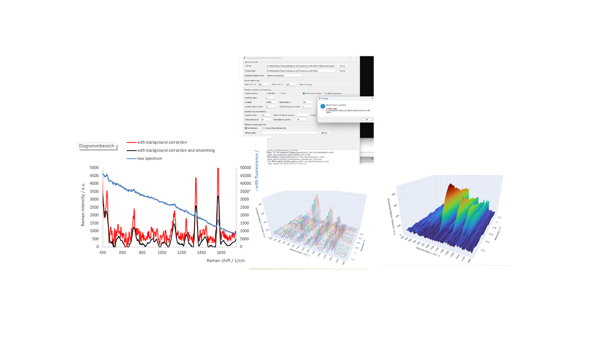

# SpectroElectroChem Suite

**Version 4.0.1 — First Public Release**

[](LICENSE)
[](https://www.python.org/)
[](https://github.com/Achim-Habekost/SpectroElectroChem-Suite/releases)
[](https://doi.org/10.5281/zenodo.21283232)

**SpectroElectroChem Suite** is open-source software for the analysis and visualization of spectro-electrochemical data. It supports Raman spectra, Raman/SERS voltammograms, absorptovoltammograms and fluorovoltammograms.

## Software Overview

<p align="center">
  
</p>

## Documentation

A comprehensive User Manual is available for installation, operation, and data analysis:

- 📘 [User Manual (PDF)](docs/SpectroElectroChem_Suite_User_Manual_v4.0.1.pdf)
- 📝 [User Manual (Word)](docs/SpectroElectroChem_Suite_User_Manual_v4.0.1.docx)

## Main features

- Raman spectrum analysis
- Raman and SERS voltammograms
- Absorptovoltammograms
- Fluorovoltammograms
- Interactive 3D surface plots
- Interactive waterfall plots
- Waterfall values exported to Excel
- Baseline correction
- Savitzky–Golay smoothing
- Heatmap and contour visualization
- Excel, HTML, PNG and PDF export
- Plugin-ready project architecture
- Documentation and packaging templates for Windows builds

## Modules

1. **Raman Spectrum Analysis**  
   Baseline correction, smoothing, peak detection and peak assignment.

2. **SERS / Raman Voltammogram**  
   Matrix CSV input with potentials in the first row and Raman shifts in the first column. Output includes interactive surface, heatmap, contour and waterfall visualizations.

3. **Absorpto- / Fluorovoltammogram**  
   Matrix CSV input with potentials in the first row and wavelengths in the first column. Output includes Excel data, surface plots, heatmaps, contour plots and waterfall values.

## Quick start on Windows

1. Download the release archive from GitHub.
2. Unzip the archive completely.
3. Run once:

```text
Install_required_Python_packages.bat
```

4. Optional test:

```text
Test_Installation.bat
```

5. Start the program:

```text
Start_SpectroElectroChem_Suite.bat
```

## Start from source

```bash
pip install -r requirements.txt
python main.py
```

## System requirements

Recommended:

- Windows 10 or Windows 11
- Python 3.10 or newer

Required Python packages are listed in `requirements.txt` and can be installed automatically with `Install_required_Python_packages.bat`.

## Documentation

A comprehensive user manual is available in the `docs` folder:

- 📘 [User Manual (PDF)](docs/SpectroElectroChem_Suite_User_Manual_v4.0.1.pdf)

- 📝 [User Manual (Word)](docs/SpectroElectroChem_Suite_User_Manual_v4.0.1.docx)

## Build Windows executable

```text
scripts\build_exe_windows.bat
```

## Build Windows installer

After the PyInstaller build, install Inno Setup and compile:

```text
installer\SpectroElectroChem_Suite_InnoSetup.iss
```

## File formats

The voltammogram modules use matrix CSV files:

- first row: potentials
- first column: Raman shifts or wavelengths
- remaining cells: intensities, absorptions or fluorescence values

## Citation

If you use SpectroElectroChem Suite in scientific work, please cite the software using the Zenodo Concept DOI:

**Zenodo Concept DOI:** https://doi.org/10.5281/zenodo.21283231

**Recommended citation:**

Habekost, A. *SpectroElectroChem Suite: Software for Raman, SERS, Absorption and Fluorescence Spectro-Electrochemical Data Analysis*. Version 4.0.1. Zenodo. https://doi.org/10.5281/zenodo.21283231

The latest archived software release and documentation are permanently available via Zenodo:

https://doi.org/10.5281/zenodo.21283231

## Support

Bug reports and feature requests are welcome via the GitHub Issues page.

## Acknowledgement

Parts of the source code were developed with the assistance of OpenAI ChatGPT and were subsequently validated, modified and extended by the author.

## License

This project is distributed under the MIT License. See `LICENSE`.

## Author

Prof. Dr. Achim Habekost
