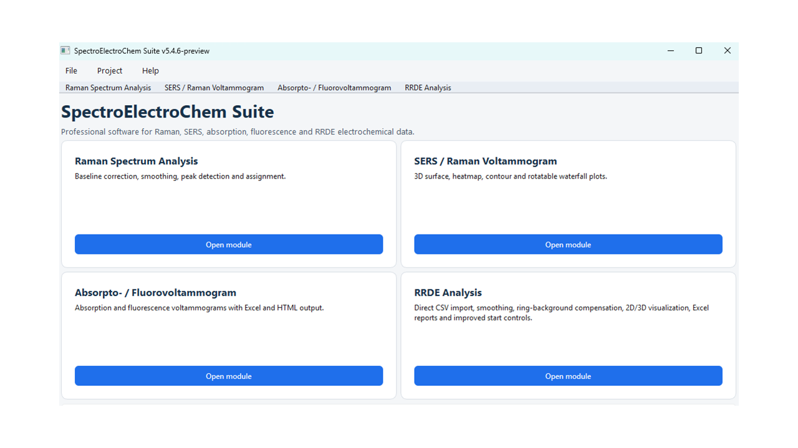
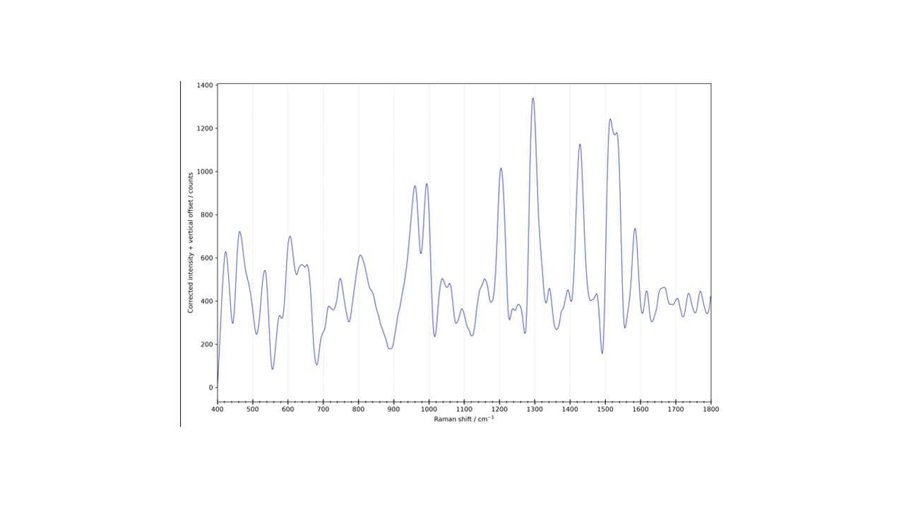
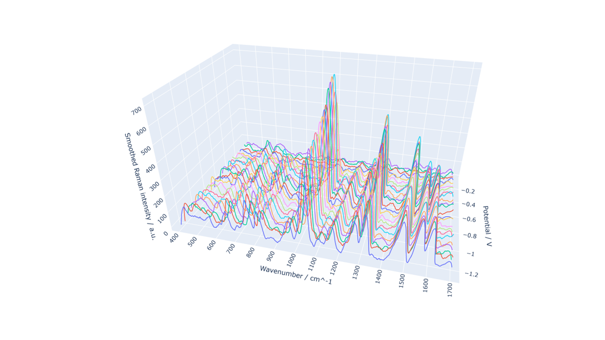
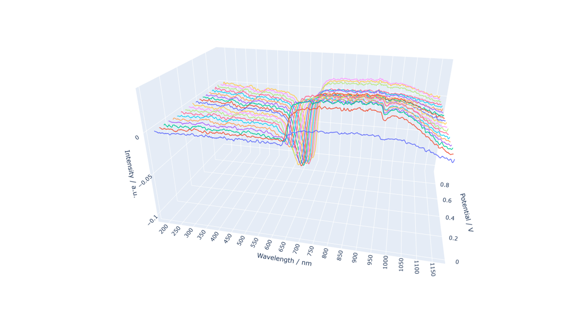
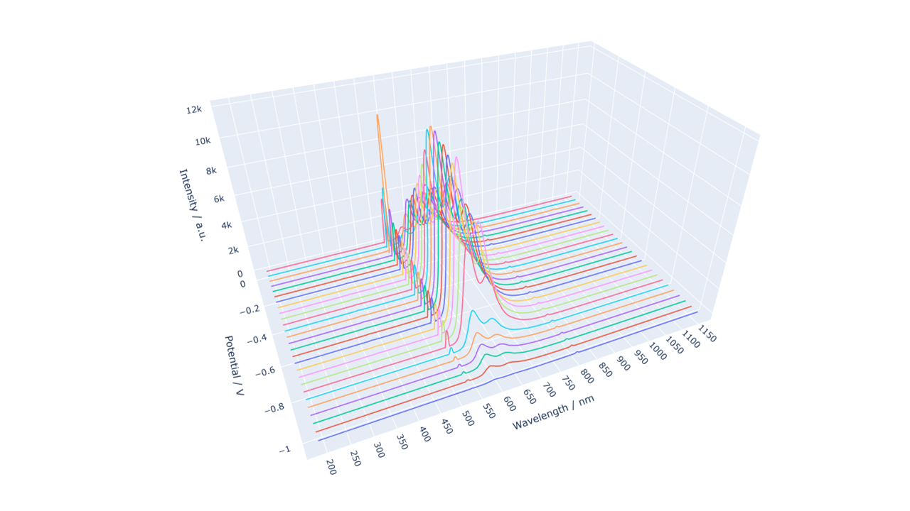
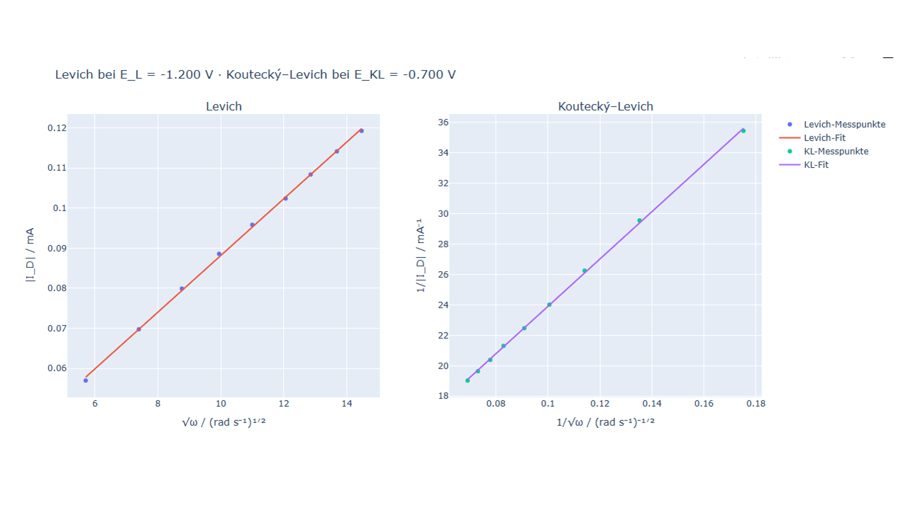

# SpectroElectroChem Suite

[](https://doi.org/10.5281/zenodo.21283231)
[](LICENSE)

**Open-source software for the analysis and visualization of
spectroelectrochemical and rotating ring--disk electrode (RRDE) data**



*Figure 1. Main window of SpectroElectroChem Suite.*

------------------------------------------------------------------------

## Overview

SpectroElectroChem Suite is an open-source Python application for the
analysis of electrochemical and spectroelectrochemical experiments. The
software combines advanced visualization, quantitative data evaluation
and publication-ready export functions within a graphical user
interface.

The suite supports Raman spectroscopy, Raman voltammetry,
absorptovoltammetry, fluorovoltammetry and rotating ring--disk electrode
(RRDE) measurements.

The RRDE module includes comprehensive electrochemical evaluation tools
such as Levich, Koutecký--Levich, Tafel and Butler--Volmer analysis.

## Contents

-   Overview
-   Main Features
-   Why SpectroElectroChem Suite?
-   Scientific Background
-   Export
-   Installation
-   Citation
-   License
-   Author

## Main Features

### Raman spectroscopy



*Figure 2. Raman spectrum of solid Rubrene.*

-   Baseline correction
-   Savitzky--Golay smoothing
-   Peak detection
-   Peak assignment
-   Publication-quality plots

### Raman voltammograms



*Figure 3. Raman voltammogram of methylene blue.*

-   Heat maps
-   Contour plots
-   Waterfall plots
-   Interactive 3D surfaces
-   Excel export

### Absorptovoltammetry



*Figure 4. Absorptovoltammogram of Rubrene (2D and 3D).*

-   Interactive spectra
-   Difference spectra
-   Heat maps
-   Waterfall plots
-   Excel export

### Fluorovoltammetry



*Figure 5. Fluorescence measurement of Rubrene.*

-   Interactive visualization
-   Excel export

### RRDE analysis



*Figure 6. RRDE analysis module.*

-   Electron-transfer number
-   Levich analysis
-   Koutecký--Levich analysis
-   Tafel analysis
-   Butler--Volmer analysis
-   Background correction
-   Ring-current compensation
-   Automatic plateau diagnostics
-   Interactive HTML plots
-   Excel report generation

## Why SpectroElectroChem Suite?

SpectroElectroChem Suite integrates data import, visualization,
quantitative evaluation and publication-ready export within a single
graphical application for research and teaching.

## Scientific Background

The software implements established electrochemical methods including
Levich analysis, Koutecký--Levich analysis, Tafel analysis,
Butler--Volmer kinetics, baseline correction, Savitzky--Golay smoothing
and peak detection. Evaluation parameters are documented in exported
reports to support transparency and reproducibility.

## Export

Results can be exported as Excel, PNG and interactive HTML.

## Installation

``` bash
git clone https://github.com/Achim-Habekost/SpectroElectroChem-Suite.git
cd SpectroElectroChem-Suite
pip install -r requirements.txt
python main.py
```

Windows users may alternatively run:

``` text
Install_required_Python_packages.bat
```

## Citation

If you use SpectroElectroChem Suite in scientific work, please cite the
software using its permanent Zenodo Concept DOI:

**DOI: [10.5281/zenodo.21283231](https://doi.org/10.5281/zenodo.21283231)**

For exact reproducibility, the DOI of the specific software version used
may additionally be cited. Citation metadata are provided in
[`CITATION.cff`](CITATION.cff).

## License

Distributed under the MIT License.

## Author

**Prof. Dr. Achim Habekost**

Email: A.Habekost@t-online.de

## Acknowledgement

Parts of the source code were developed with the assistance of OpenAI
ChatGPT. The scientific concepts, algorithms, validation and final
implementation are the responsibility of the author.

## Project status

SpectroElectroChem Suite is actively maintained and continuously
extended with new electrochemical and spectroelectrochemical analysis
modules.
