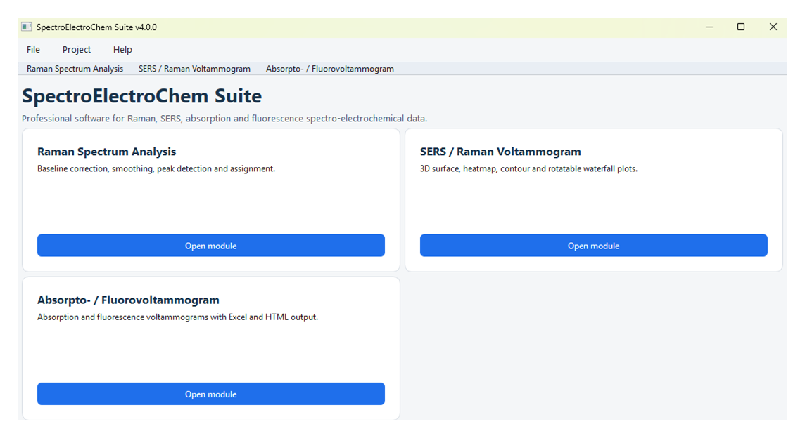
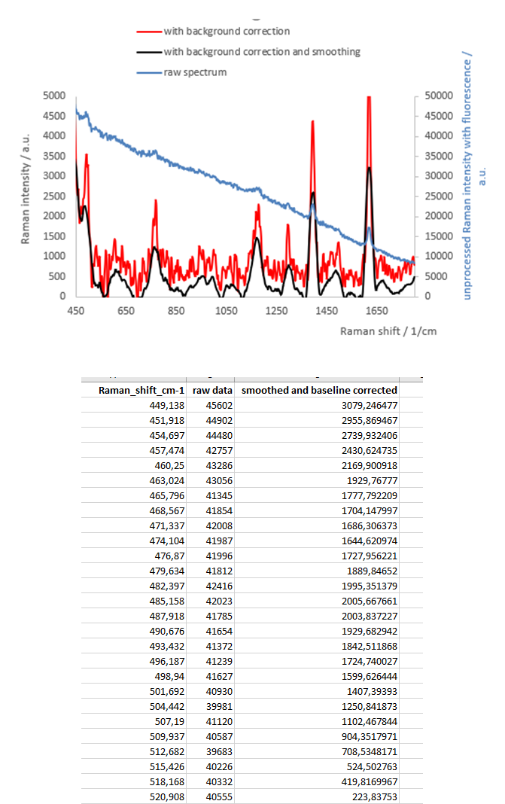

# Summary

Spectro-electrochemical experiments combine Raman spectroscopy, surface-enhanced Raman spectroscopy (SERS) [@Smith2019; @Langer2020], absorption spectroscopy, and fluorescence spectroscopy with electrochemical control [@Lozeman2020]. `SpectroElectroChem Suite` is a free, open-source desktop application that integrates the processing, visualisation, and export of these multidimensional datasets within a single graphical user interface. The software comprises three modules: one for single- and multi-column Raman spectra; one for potential-resolved Raman/SERS intensity matrices; and one for absorptovoltammograms and fluoro-voltammograms. Core functions include baseline correction, Savitzky-Golay and moving-average smoothing, automatic peak detection and identification, and interactive 3D surface, heatmap, contour, and waterfall visualisations. Every numerical stage is exported to documented Excel workbooks alongside publication-quality PNG/PDF figures and interactive HTML graphics, ensuring analyses remain transparent and reproducible. The software is written in Python, distributed under the MIT licence, developed openly on GitHub, and permanently archived on Zenodo [@Habekost2026].

# Statement of need

Potential-resolved spectral datasets present two practical challenges. Firstly, preprocessing is crucial: broad fluorescence and scattering backgrounds often mask weak Raman bands, so baseline correction, smoothing, and robust peak detection must be performed prior to any interpretation. The chosen parameters must be traceable to ensure reproducibility of the analysis [@Smith2019; @Habekost2023; @Savitzky1964; @Baek2015]. Secondly, the data are multidimensional by nature: potential-dependent band evolution cannot be judged from individual spectra alone and requires representations such as waterfalls, heatmaps, contours, and surfaces that treat the electrode potential as equally important as the spectral axis.

Existing tools serve users who write code, or they are tied to specific instruments. This leaves experimental electrochemists, students, and technical staff—who primarily need to process voltammogram matrices, judge baseline models visually, and export publication-ready figures—with manual spreadsheet work that is slow, error-prone, and poorly documented.

`SpectroElectroChem Suite` addresses this gap with a user-friendly graphical application organised around the spectro-electrochemical data structure itself (potentials in the first row, spectral coordinates in the first column). The software is intended for both research and teaching, where transparent, checkable processing steps have direct didactic value. It grew out of, and is used in, university spectro-electrochemistry experiments [@Habekost2023; @Wagler2022].

# State of the field

Instrument-vendor software is tied to specific hardware and closed file formats. It is rarely scriptable or inspectable and typically treats the electrochemical dimension as an afterthought. In the open-source arena, powerful Python libraries exist for specific tasks: `pybaselines` for baseline estimation [@Erb2022], SciPy for filtering and peak detection [@Virtanen2020], and RamanSPy for integrated, scriptable Raman pre-processing and machine-learning workflows [@Georgiev2024]. While these libraries are excellent, they are aimed at users who write code and do not treat the potential-resolved matrix as a first-class object. Table 1 positions `SpectroElectroChem Suite` relative to these tools.

| Tool | Primary interface | Scope | Electrochemical dimension |
|:--|:--|:--|:--|
| `SpectroElectroChem Suite` | Graphical (install-and-run) | Raman/SERS/absorption/fluorescence spectra and potential-resolved matrices; preprocessing, visualisation, Excel export | Potential supported as native axis |
| RamanSPy [@Georgiev2024] | Python library (scripting) | Raman preprocessing/analysis pipelines, machine-learning integration, datasets | Not addressed |
| `pybaselines` [@Erb2022] | Python library (scripting) | Baseline-estimation algorithms only | Not addressed |
| SciPy [@Virtanen2020] | Python library (scripting) | General filtering and peak finding | Not addressed |
| Vendor/instrument software | Graphical | Acquisition and basic processing, instrument-specific | Rarely; closed formats |

: `SpectroElectroChem Suite` in relation to representative open-source tools and vendor software. []{#tab:comparison}

The distinguishing contribution is therefore not a new algorithm, but an integrated, reproducible, GUI-based workflow: it makes established methods [@Savitzky1964; @Baek2015; @Virtanen2020; @Erb2022] usable on spectro-electrochemical data without programming, while ensuring that every intermediate result can be inspected.

# Software design

## Architecture

`SpectroElectroChem Suite` is a modular desktop application written in Python (>= 3.10). A central launcher opens three independent modules—Raman Spectrum Analysis, Raman/SERS Voltammogram, and Absorpto-/Fluorovoltammogram—which share common input conventions and export routines (
\autoref{fig:launcher}). All modules read plain CSV files, so data from any spectrometer or potentiostat can be analysed after a simple export, regardless of proprietary formats. The numerical core relies on the scientific Python ecosystem: NumPy [@Harris2020] and pandas [@McKinney2010] for data handling, SciPy [@Virtanen2020] for Savitzky-Golay filtering and peak processing, `pybaselines` [@Erb2022] for baseline estimation, Matplotlib [@Hunter2007] for static figures, Plotly [@Plotly] for interactive HTML graphics, and `openpyxl` [@Openpyxl] for Excel export. The interfaces are built with PySide6 and Tkinter.

{#fig:launcher width="90%"}

Two design principles run through all modules. Firstly, every processing stage can be inspected and exported simultaneously: raw, smoothed, baseline-corrected, and plotted values, together with the calculated baselines and a metadata sheet recording the source file, the selected ranges, and all parameters. Secondly, any visualisation choice that alters the displayed magnitudes—such as percentile clipping, `log1p` scaling, or waterfall offsets—is recorded in the output, so it can be explicitly reported in publications rather than remaining hidden in the figure.

The modules cover baseline correction (polynomial and penalised methods), Savitzky-Golay and moving-average smoothing, automatic peak detection (position, intensity, FWHM) with tolerance-based identification against reference lists, intensity scaling (linear, 99th-percentile clipping, `log1p`, combined), and linked interactive 3D surface, heatmap, contour, and rotatable waterfall views with numerical waterfall export (shifted and unshifted matrices plus an offset table).

## Reproducibility and data integrity

Reproducibility is treated as a primary requirement. Each run creates a metadata sheet containing the software version and version-specific DOI, the input file, the selected spectral and potential ranges, all smoothing, baseline, and scaling parameters, and the raw and processed matrices in matrix and long formats. Because raw and processed values are preserved together, any figure can be traced back to the underlying data, enabling an independent user to regenerate the same output from the archived CSV and recorded parameters. The recommended workflow documented in the manual makes this explicit, from read-only archiving of the instrument export to the parameter record that should accompany a publication.

## Documentation, testing, and maintainability

A versioned user manual describes installation, input-file specifications, every module, all signal-processing options, and a reproducible end-to-end workflow; it is archived together with the code on Zenodo. The release includes scripts that install pinned dependencies from a requirements file and verify that the interpreter and principal packages import correctly, reducing environment-related failures for non-programmers. The current release includes installation and dependency verification as well as validation against representative experimental datasets. Automated tests validate the numerical core (baseline correction, smoothing, peak detection, and CSV parsing) using representative spectro-electrochemical datasets including rubrene, methylene blue, and spiropyrans. The modular structure isolates the three workflows behind shared input/output and export code, so new baseline models, further spectroscopic modalities, or batch processing can be added without disturbing existing modules.

Development is public on GitHub with issue tracking for bug reports and feature requests, and each release is permanently archived on Zenodo under a citable DOI. Contributions are welcome via the [project repository](https://github.com/Achim-Habekost/SpectroElectroChem-Suite).

# Research impact statement

The software grew out of published university spectro-electrochemistry experiments on the absorption spectro-electrochemistry and SERS of methylviologen [@Habekost2023] and on methylene blue chemistry for university education [@Wagler2022]. It is now used in undergraduate and graduate laboratory courses as well as ongoing research projects.

\autoref{fig:methylene-blue} illustrates a typical workflow: the Raman spectrum of methylene blue before and after preprocessing. The broad fluorescence background is removed by baseline correction, noise is suppressed without visibly broadening the bands by Savitzky-Golay smoothing, and characteristic bands are located, identified, and tabulated automatically, with the full peak table written to the Excel workbook.

{#fig:methylene-blue width="90%"}

For potential-resolved SERS datasets, the voltammogram module converts the intensity matrix into linked waterfall, heatmap, contour, and rotatable 3D surface views, so potential-dependent band growth, decay, and shifts can be observed and exported directly for publication; the same concepts apply to absorption and fluorescence data. All example datasets, CSV templates, and the versioned manual are distributed with the archived releases, so the workflows shown here are directly reproducible by independent users.

# AI usage disclosure

Parts of the software implementation were developed with the assistance of OpenAI's ChatGPT (code generation and refactoring suggestions). No generative AI was used to produce the scientific content of this paper. The author reviewed, scientifically validated, modified, tested, and substantially extended all AI-assisted code, and made all core design decisions.

# Acknowledgements

The author received no financial support for the development of this software.

# References
